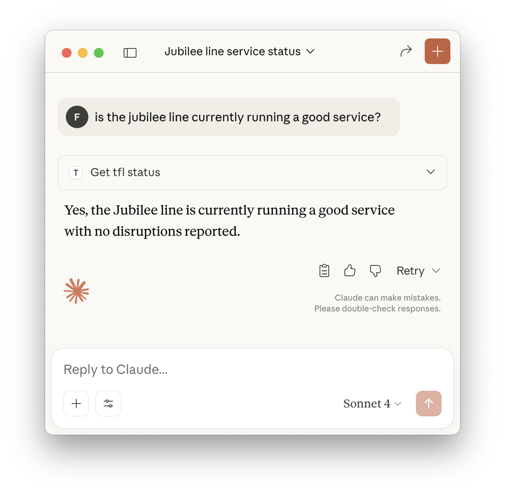

# TFL Line Status API (with MCP)

Welcome to the TFL Line Status API project! 🚇

This project implements a simple MCP server. Its purpose is to fetch and processes real-time status information for London Underground lines using the official TFL API.


<div align="center">

</div>
## Features
- Fetches live status for all major London Underground lines
- Processes and formats the data as JSON
- Example code for both script and notebook usage
- Exposed as an MCP (Model Context Protocol) tool, runnable locally over
  stdio or as a hosted Azure Function App — see `DEPLOYMENT.md`
- A LangGraph agent (`tfl_status_agent/`) that answers line-status
  questions by calling the MCP tool above, exposed over the A2A protocol
  and deployable as its own Entra-gated Container App — see `DEPLOYMENT.md`

## Quickstart

### 1. Clone the repo
```sh
git clone https://github.com/Fredheda/tfl-mcp.git
cd tfl-mcp
```

## MCP Server Usage

This project is a ready-to-run MCP (Model Context Protocol) server. When you run `python tfl.py`, it starts an MCP server that you can connect to with:

- **Claude Desktop**: Add a new MCP server and point it to your running instance.
- **Your own MCP client**: See the [Model Context Protocol documentation](https://modelcontextprotocol.io/docs/develop/build-server) for details.


### 2. Set up your environment (Recommended: [Poetry](https://python-poetry.org/))
```sh
poetry install
```

This project uses Poetry (`pyproject.toml` + `poetry.lock`) for dependency
management.

### 3. Run the script
```sh
poetry run python tfl.py
```